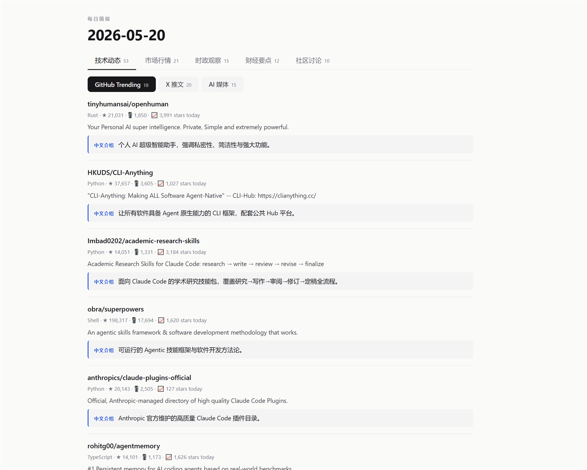
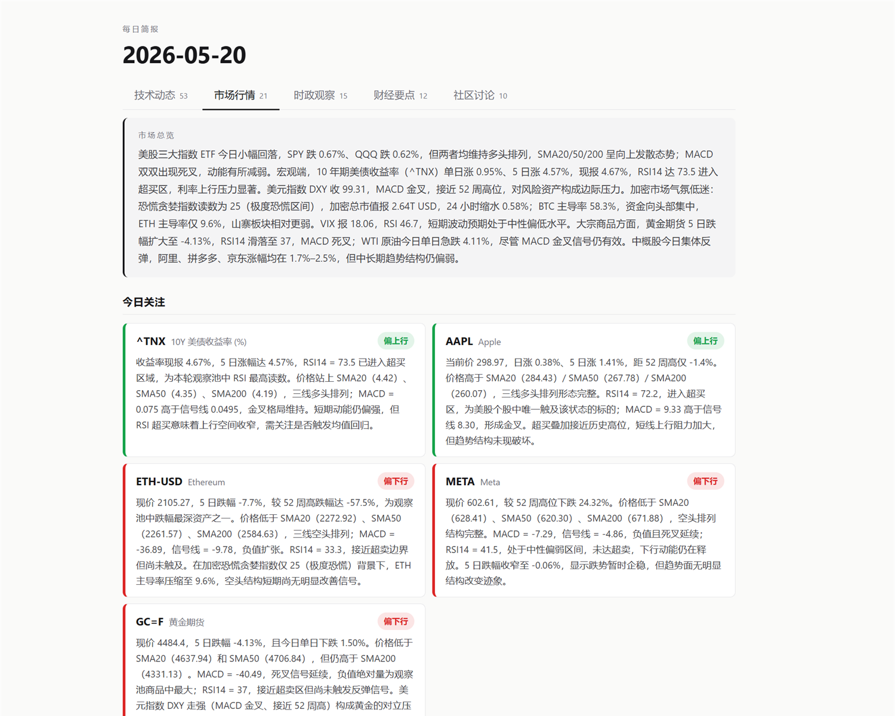
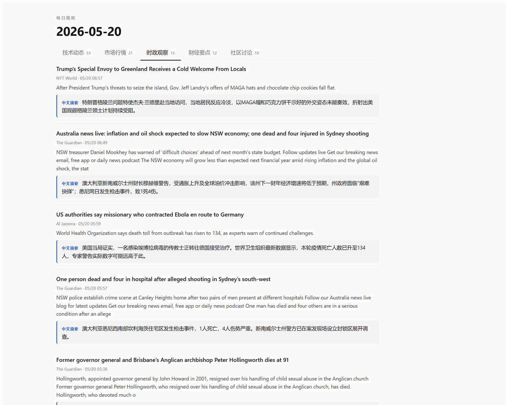
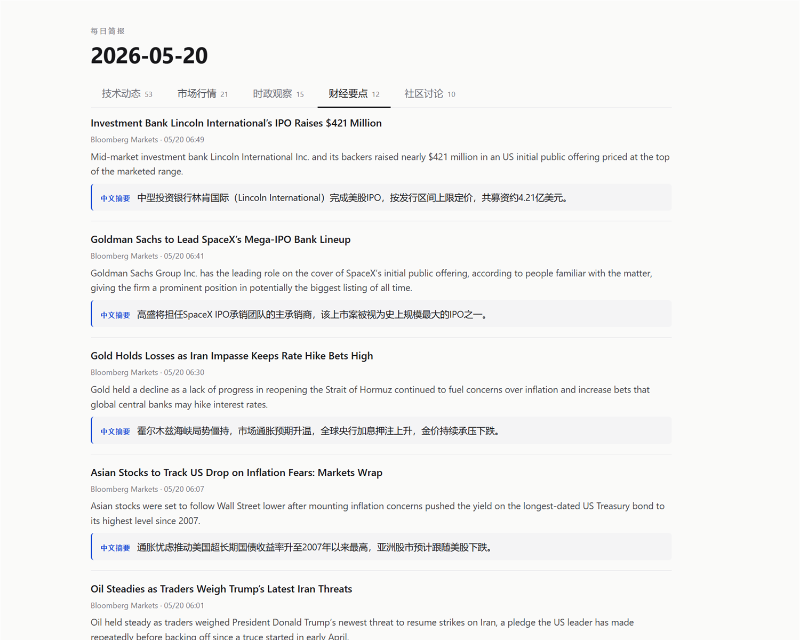

# 📰 daily-brief · your own AI-curated daily news brief in 10 minutes

[中文](./) · **[English](README.en.md)**

[](LICENSE)
[](https://nodejs.org/)
[](https://www.typescriptlang.org/)
[-orange.svg)](#-llm-backend-configuration)
[](#a-github-actions--pages-zero-infra-recommended)
[](https://leiting-eric.github.io/DailyBrief)
[](https://github.com/leiting-eric/DailyBrief)

> **Your own AI-curated daily news brief, on infrastructure you control.** 23 sources · LLM summaries · 21-ticker market panel with SMA/RSI/MACD signals + AI commentary · bilingual (zh/en) · 5 swappable LLM backends.
>
> **Three deployment paths, pick one:** [**🚀 5-min GitHub Actions fork**](#a-github-actions--pages-zero-infra-recommended) · [**💻 local one-liner install**](#b-local-one-liner-install) · [**🤖 have an AI agent install it for you**](#c-have-an-ai-agent-install-it-for-you).

**🌐 Live demos** —
[📰 leiting-eric.github.io/DailyBrief](https://leiting-eric.github.io/DailyBrief) (path A · GitHub Actions + Pages)
·
[📰 daily.leiting.tech](https://daily.leiting.tech) (path B · self-hosted server)

<table>
  <tr>
    <td width="50%" align="center"><br><sub>🧑‍💻 Tech — GH Trending + X posts + AI media</sub></td>
    <td width="50%" align="center"><br><sub>📈 Markets — 21-ticker technicals + AI commentary</sub></td>
  </tr>
  <tr>
    <td width="50%" align="center"><br><sub>🌍 World — BBC / Guardian / NYT</sub></td>
    <td width="50%" align="center"><br><sub>💰 Finance — Bloomberg / WSJ / FT</sub></td>
  </tr>
</table>

---

## ✨ Core features

- **🌍 Multi-source aggregation** — 23 sources spanning Silicon Valley tech, AI frontier, global finance, international politics, and developer communities. One report covers it all.
- **📈 21 live tickers** — US stocks / crypto / HK / commodities / macro signals, with SMA / RSI / MACD indicators + daily LLM-written trading commentary
- **🤖 5 swappable LLM backends** — Claude CLI / Anthropic / OpenAI / DeepSeek / MiniMax. One env var to switch, no vendor lock-in.
- **🌐 Bilingual (zh/en)** — set `REPORT_LOCALE=en` to flip the entire stack: sources, prompts, UI text, Bullish/Bearish stance labels — all switch.
- **🚀 Flexible deployment** — GitHub Actions (zero infra) / local OS scheduler / self-hosted server — pick one or run them in parallel
- **🆓 Zero data-source API keys** — every source uses free public endpoints (RSS / public JSON), no paid subscriptions
- **🔒 No third-party reader lock-in** — Feedly / Inoreader / Pocket all profile your reading; this project never talks to them. Your reading habits stay yours.
- **📁 Single-file HTML output** — CSS and JS inlined, no external dependencies, scp'able onto a server as `index.html`

---

## 📚 Source roster

23 sources in zh mode / 22 in en mode, organized as:

### 🧑‍💻 Tech
- **GitHub Trending** · refreshed daily
- **AI media** (merged): OpenAI / DeepMind / Hugging Face Blog / TLDR AI / Smol AI / Latent Space / MIT Tech Review
- **X posts** (attentionvc-ai): curated AI thought-leader feed

### 📈 Markets (21 tickers, not news)
- **US stocks / ETFs**: SPY / QQQ / AAPL / MSFT / NVDA / GOOGL / TSLA / META
- **Crypto**: BTC / ETH / SOL (+ alt.me Fear & Greed index + CoinGecko macro)
- **China / HK**: BABA / PDD / JD / 0700.HK
- **Commodities / FX**: GC=F (gold) / CL=F (WTI crude) / USDCNY=X
- **Macro signals**: ^VIX / ^TNX (10Y Treasury) / DXY

### 🌍 World
**BBC / Guardian / NYT / NPR / DW Chinese / Al Jazeera / The Diplomat** — 7 major international outlets' World feeds

### 💰 Finance
**Bloomberg / WSJ / FT / BBC Business / Economist** — 5 global finance heavyweights

### 💬 Community
- **zh mode**: V2EX top threads / LinuxDo trending
- **en mode**: Hacker News / Reddit r/stocks (auto-substituted)

> Full list + enabled status: run `npm run sources`. To edit sources, modify [`sources.config.json`](sources.config.json).

---

## 🚀 Pick one deployment path

| Path | Who it's for | What you need | Setup time |
|---|---|---|---|
| **A. GitHub Actions + Pages** | No server, don't want to keep a laptop running | One API key (Anthropic / OpenAI / DeepSeek / MiniMax) | ~5 min (recommended) |
| **B. Local one-liner** | Have an always-on machine; want it cheapest | Node 20+, optionally Claude Code login | ~3 min |
| **C. Have an AI agent install it** | Lazy; want Cursor / Codex / Claude Code to handle setup | Same as B | One sentence |

### A. GitHub Actions + Pages (zero-infra, recommended)

1. **Fork this repo** (Fork button, top-right of GitHub)
2. **Settings → Actions → General → Workflow permissions** → set to **Read and write permissions**
3. **Settings → Pages → Build and deployment → Source** → "Deploy from a branch" → branch `gh-pages` / path `/ (root)` (the `gh-pages` branch only exists after the first successful workflow run — configure secrets first, trigger once, then come back)
4. **🔑 Configure the LLM backend** — this is the critical step. Each backend needs **a secret AND the matching `LLM_BACKEND` variable** (not just the secret). Pick one row:

   | You want | Secret to add | `LLM_BACKEND` variable | Rough cost |
   |---|---|---|---|
   | 🟣 **Anthropic Sonnet** (default; prompts tuned for it) | `ANTHROPIC_API_KEY` | leave unset or `anthropic` | ~$0.03-0.05/day, <$2/month |
   | 🐋 **DeepSeek** (cheap, China-friendly) | `DEEPSEEK_API_KEY` | `deepseek` | ~$0.01-0.02/day, <$1/month |
   | 🟢 **OpenAI** | `OPENAI_API_KEY` | `openai` | gpt-4o-mini ~$0.02/day |
   | 🔵 **MiniMax** | `MINIMAX_API_KEY` | `minimax` | Similar to DeepSeek |

   Location: **Settings → Secrets and variables → Actions**. The page has two tabs — **Secrets** for keys, **Variables** for `LLM_BACKEND`.

5. (Optional) On the same Variables tab, add:
   - `LLM_MODEL` — override the backend's default model (otherwise uses the default listed in [`.env.example`](.env.example))
   - `REPORT_LOCALE` — `zh` (default) or `en` — switches sources + UI + LLM prompts as a set
   - `REPORT_TZ` — IANA timezone name (default in CI is UTC); e.g. `Asia/Shanghai` / `America/Los_Angeles` — affects the date label
6. **Actions tab → "Daily Brief" workflow → Run workflow** to trigger manually for the first time

Once the workflow turns green, your report lives at `https://<your-username>.github.io/<repo-name>/`, refreshed daily at 08:00 UTC. Change the schedule by editing the cron line at [`.github/workflows/daily.yml:24`](.github/workflows/daily.yml#L24).

**💸 Cost summary**: GitHub Actions on public repos is free. Pages on public repos is free. The only thing you pay for is LLM API calls — DeepSeek runs under $1/month, Anthropic Sonnet under $2.

> ⚠️ **GH Actions mode can't reuse a local `claude` CLI login** — your Claude Code OAuth token lives on your machine, GitHub's runners can't see it. If you have a Max subscription, run both paths side by side: path B locally (uses Claude CLI), path A on GitHub Actions (uses DeepSeek). Independent reports, no interference.

#### 🐛 Common gotchas

- **"Upgrade or make this repository public to enable Pages"** — Free-tier GitHub Pages requires a public repo. Settings → General → Danger Zone → Change visibility → Public. Your Actions Secrets remain encrypted and invisible to others even on public repos.
- **"Variable name can only contain alphanumeric characters"** — most likely the underscore in `LLM_BACKEND` got autocorrected by a CJK input method to a full-width `＿` (U+FF3F). Switch to English input, retype Shift+`-`, or copy-paste.
- **Pages source dropdown doesn't show `gh-pages`** — that branch only exists after the first successful workflow run. Order: configure secret → trigger workflow → wait for green → go back to Settings → Pages.
- **Where to read a failed run** — Actions tab → click the red X → left sidebar lists each step → click the failing one to expand its log. Most common causes: `401`/`402` (API key wrong or out of credit), `403` (workflow permissions still set to "Read only").
- **Fails after ~30 seconds** — usually a secret/variable mismatch (added a secret but didn't add the matching `LLM_BACKEND` variable) or the LLM API returned 400. Check the "Generate today's report" step.

### B. Local one-liner install

```bash
# Linux / macOS
curl -sSL https://raw.githubusercontent.com/leiting-eric/DailyBrief/main/bootstrap.mjs | node

# Windows PowerShell
irm https://raw.githubusercontent.com/leiting-eric/DailyBrief/main/bootstrap.mjs | node -
```

This script will:
1. Check that Node / git / claude CLI are on PATH (claude CLI missing is a warning, not an error — you can use an API backend instead)
2. `git clone` to `~/daily-brief` (Windows: `%USERPROFILE%\daily-brief`)
3. `npm install`
4. Register the OS scheduler (Windows Task Scheduler / macOS launchd / Linux cron, default 16:00 local time)
5. Write `~/.daily-brief-config` recording the project path
6. Symlink the Claude Code skill + slash commands into `~/.claude/` so they work from any directory
7. Run `npm run dry-run` as a smoke test

**🎁 Claude Code bonus**: after install, any Claude Code session anywhere can use `/run-daily` and `/check-daily`. Describing a problem in plain English ("today's report didn't come out") also auto-loads the `daily-brief` skill. **Other agents** (Cursor / Codex) don't have a skill auto-load mechanism, but the scheduled task still runs at the OS level. Manual triggers:

| Platform | Command |
|---|---|
| Windows | `Start-ScheduledTask -TaskName DailyBrief` |
| macOS | `launchctl start com.daily-brief` |
| Linux | `node scripts/run-daily.mjs` (cron doesn't support manual trigger) |

Custom install path / time:

```bash
node bootstrap.mjs --target /custom/path --at 07:30
```

**LLM backend**: defaults to the local `claude` CLI (first time you'll need to log in once in a browser: `echo "hi" | claude --print --model sonnet` — once is forever). If you don't use Claude Code, skip it: copy `.env.example` to `.env.local` and set `LLM_BACKEND` to OpenAI / Anthropic / DeepSeek / MiniMax — see [LLM backend configuration](#-llm-backend-configuration).

### C. Have an AI agent install it for you

Whichever AI agent you use (Claude Code / Cursor / Codex / Continue.dev / OpenClaw / etc.), send it this prompt:

> Please install this open-source project following the README's "local one-liner" path with bootstrap, and tell me when the next auto-trigger will fire:
> https://github.com/leiting-eric/DailyBrief

The repo includes [`AGENTS.md`](AGENTS.md) (universal agent protocol) and [`.claude/skills/daily-brief/SKILL.md`](.claude/skills/daily-brief/SKILL.md) (Claude Code-specific, more detailed). After install, the agent can help diagnose things like "today's report didn't come out" or "add a new source".

---

## 📋 Requirements

- **Node.js 20+**, **npm**, **git** (local for paths B/C; path A runs in GitHub's containers — no local install needed)
- **One working LLM** (any of): Claude Code CLI logged in, OR Anthropic / OpenAI / DeepSeek / MiniMax API key
- Platform: Windows 10/11, macOS 12+, Linux (any platform — scheduler picks the matching mechanism)

---

## 🔧 Manual install

```bash
# 1. Clone + dependencies
git clone https://github.com/leiting-eric/DailyBrief.git
cd DailyBrief
npm install

# 2. Pick an LLM backend
#    Default = claude CLI (will guide you through login if not done):
echo "say hi" | claude --print --model sonnet
#    Or use a different backend: cp .env.example .env.local
#    and set LLM_BACKEND + the matching API key

# 3. Register the scheduler + enable the global skill
node scripts/install.mjs --global

# 4. Test trigger immediately
# Windows:  Start-ScheduledTask -TaskName DailyBrief
# macOS:    launchctl start com.daily-brief
# Linux:    node scripts/run-daily.mjs
```

Sleep-wake behavior at next trigger time:
- **🪟 Windows** — wakes the computer if asleep, runs, returns to sleep
- **🍎 macOS** — launchd doesn't wake from deep sleep; skipped if asleep (configure `pmset wake schedule` separately if needed)
- **🐧 Linux** — cron doesn't wake either; skipped if suspended

---

## 🛠️ Daily commands

| Command | Purpose | Time |
|---|---|---|
| `npm run daily` | Full pipeline (fetch + LLM + render) | 5-8 min |
| `npm run dry-run` | Fetch only, no LLM — validates sources | ~30s |
| `npm run render [date]` | Re-render HTML after editing CSS/layout | <1s |
| `npm run regen-trading [date]` | Re-do the trading section only | ~2 min |
| `npm run regen-enrich <cat:sub> [date]` | Fill in missing summaries for a subgroup | ~30s |
| `npm run open` | Open today's report in Chrome | instant |
| `npm run quota-report` | Per-backend LLM usage summary | instant |
| `npm run sources` | List all sources with locale / enabled status | instant |
| `npm run sources:check` | Validate `sources.config.json` schema (good for CI / pre-commit) | instant |

---

## 📊 Source configuration

Sources live as a JSON array in [`sources.config.json`](sources.config.json) at the project root — **the single source of truth**. Add / disable / re-categorize feeds without touching TypeScript. Per-entry fields:

| Field | Required | Notes |
|---|---|---|
| `id` | ✓ | Short unique identifier (used by `dispatch.ts` to route to the right fetcher) |
| `name` | ✓ | Display name in the UI |
| `type` | ✓ | `rss` / `api` / `scrape` |
| `url` | ✓ | RSS feed URL or API endpoint |
| `category` | ✓ | `tech` / `finance` / `politics` — drives the L1 tab |
| `subcategory` |  | L2 grouping (`github-trending` / `ai-news` / `x-viral` / `cn-community` for tech; `news` for finance) |
| `enabled` |  | Default `true`; set to `false` to skip without deleting the record |
| `useCurl` |  | `true` if the source's host blocks Node's TLS fingerprint (Cloudflare); the fetcher will shell out to curl |
| `lang` |  | `zh` means the source is already in Chinese — enrich skips it (no need to translate Chinese into Chinese) |
| `locales` |  | Array listing which `REPORT_LOCALE` the source appears in. Default `["zh", "en"]` |
| `notes` |  | Free-form (e.g. "removed because feed died"); ignored at runtime |

### Adding an RSS source

1. Append an entry to `sources.config.json`
2. Run `npm run sources:check` to validate schema
3. `npm run dry-run` to confirm the fetch works
4. The next `npm run daily` picks it up automatically

### 🌐 Locale mode (zh / en)

Switch with the `REPORT_LOCALE` environment variable:

```bash
# .env.local
REPORT_LOCALE=zh    # default — Chinese mode, includes V2EX / LinuxDo / DW Chinese
# REPORT_LOCALE=en  # English mode — drops zh-only sources, picks up en-only ones
```

Each source's `locales` field decides which mode it appears in:

- `["zh"]` — **zh mode only** (V2EX / LinuxDo / DW Chinese). English readers can't read these, so auto-dropped in en mode.
- `["en"]` — **en mode only** (Hacker News / r/stocks etc., picked up to replace Chinese community sources). Not shown in zh mode.
- `["zh", "en"]` (default) — appears in both modes (BBC / Bloomberg / WSJ / NYT / AI media)

Currently enabled sources by locale:

| Locale | Enabled sources | Mix |
|---|---|---|
| `zh` | 23 | 20 global / English sources (with LLM-generated Chinese summaries) + 3 Chinese-only (V2EX / LinuxDo / DW Chinese) |
| `en` | 22 | 20 global / English sources + 2 English community (Hacker News + r/stocks) |

The full en-mode switch covers: HTML UI text, the three LLM prompt sets (enrichment / digest / trading commentary), stance labels (Bullish/Bearish/Neutral vs. 偏上行/偏下行/中性), date format (`zh-CN` ↔ `en-GB`), Markdown output. **Chinese community sources are auto-hidden in en mode** since the audience can't read them.

---

## 🤖 LLM backend configuration

The project switches backends via the `LLM_BACKEND` environment variable. **Default is `claude-cli`** — it reuses your existing Claude Code login, no API key needed. To use your own API key with another provider, set up `.env.local`:

Copy `.env.example` to `.env.local` (gitignored), uncomment the section for your chosen backend:

| backend | API key env var | Default model | Base URL |
|---|---|---|---|
| 🎯 `claude-cli` (default) | None — reuses Claude Code OAuth | `sonnet` | — |
| 🟣 `anthropic` | `ANTHROPIC_API_KEY` | `claude-sonnet-4-6` | `api.anthropic.com` |
| 🟢 `openai` | `OPENAI_API_KEY` | `gpt-4o-mini` | `api.openai.com/v1` |
| 🐋 `deepseek` | `DEEPSEEK_API_KEY` | `deepseek-v4-flash` | `api.deepseek.com/v1` |
| 🔵 `minimax` | `MINIMAX_API_KEY` | `MiniMax-M2.7` | `api.minimax.io/v1` <sup>1</sup> |

<sup>1</sup> Inside mainland China, set `MINIMAX_BASE_URL=https://api.minimaxi.com/v1`.

**Universal overrides**:
- `LLM_MODEL=<id>` — works for any backend (e.g. `LLM_MODEL=gpt-4o` to use OpenAI's bigger model)
- `<BACKEND>_BASE_URL` — for self-hosted proxies or OpenAI-compatible services (e.g. LM Studio / Ollama → `LLM_BACKEND=openai` + `OPENAI_BASE_URL=http://localhost:1234/v1`)

### How to pick

| Your situation | Recommended backend |
|---|---|
| Already using Claude Code (any subscription tier) | `claude-cli` — zero config, billed against your subscription |
| Not on Claude Code, want it cheapest | `openai` with `gpt-4o-mini`, or `deepseek` (cheaper still) |
| Chinese summary quality matters most | `anthropic` with `claude-sonnet-4-6` |
| Need to bypass China's network restrictions | `deepseek` or `minimax` (both are domestic providers) |

**Switching backends needs no code changes**: all prompts are factored out in `lib/ai/prompts.ts` independently of any backend; JSON repair fallback (`jsonrepair`) is backend-agnostic. After switching, run `npm run daily` once and look at `logs/llm-calls.jsonl` for the new backend's call log.

---

## 🌐 Self-hosted deployment (optional)

After each `npm run daily`, automatically scp the fresh HTML to your own server; visitors hit `https://your-domain/` and see today's report. **Disabled by default** — leave the env vars unset to skip.

### One-time server setup

Assumes Ubuntu + nginx, domain configured, login user has sudo NOPASSWD:

```bash
# On the server
sudo mkdir -p /var/www/your-domain && sudo chown -R www-data:www-data /var/www/your-domain
```

`/etc/nginx/sites-available/your-domain.conf`:

```nginx
server {
    listen 80;
    server_name your-domain;
    root /var/www/your-domain;
    index index.html;
    location / { try_files $uri $uri/ =404; }
}
```

Enable + auto-issue SSL:

```bash
sudo ln -s /etc/nginx/sites-available/your-domain.conf /etc/nginx/sites-enabled/
sudo nginx -t && sudo systemctl reload nginx
sudo certbot --nginx -d your-domain --agree-tos --redirect
```

### Enable auto-deploy locally

In `.env.local` (gitignored), add:

```
DEPLOY_HOST=user@your-server-ip
DEPLOY_PATH=/var/www/your-domain
```

Then:
- ✅ Every `npm run daily` auto-scp's the new HTML to the server and refreshes `index.html`
- ✅ `npm run deploy [YYYY-MM-DD]` to push any specific date manually
- ✅ A deploy failure doesn't break the daily run itself (HTML is already on disk in `daily_reports/`; `npm run deploy` retries it)

---

## 💡 Claude Code integration

**After install, any directory** (no need to `cd` into the project) running Claude Code can use:

| Trigger | Behavior |
|---|---|
| `/run-daily` | Triggers daily immediately, monitors in the background until done. Works from any directory. |
| `/check-daily` | Checks task state + report files + quota |
| Describing a problem ("today's report didn't come out", "why didn't X posts update") | Auto-loads the `daily-brief` skill so Claude understands the project context |

**How it works**: `scripts/install.mjs --global` symlinks files in `~/.claude/` pointing at the project's [`.claude/skills/daily-brief/SKILL.md`](.claude/skills/daily-brief/SKILL.md) and [`.claude/commands/`](.claude/commands/) — **single source**, editing the project files is editing the user-level skill. If symlinks aren't permitted (Windows without Developer Mode), it falls back to copying. `~/.daily-brief-config` records the absolute project path so slash commands find it from any CWD.

---

## 📁 Project structure

```
daily-brief/
├── lib/
│   ├── sources/        # RSS / API / curl fetchers; add new sources here
│   ├── ai/             # Pluggable LLM backends + prompts (lib/ai/backends/ per backend)
│   ├── trading/        # Yahoo Finance + technical indicators
│   └── output/         # Rendering (HTML / Markdown)
├── scripts/
│   ├── daily.ts        # Main pipeline
│   ├── render.ts       # Re-render from cached data
│   ├── regen-*.ts      # Targeted re-runs
│   ├── quota-report.ts # LLM usage stats
│   ├── run-daily.mjs   # Scheduler wrapper
│   ├── open-report.mjs # Cross-platform "open latest" helper
│   ├── build-site.mjs  # GH Pages static-site generator (index + archive)
│   ├── install.mjs     # Cross-platform scheduler registration
│   └── uninstall.mjs   # Removal
├── daily_reports/      # Output (gitignored)
│   └── 2026-05-15/     # One subdir per day, contains .html (main) / .json (cache) / -articles.json (cache)
│                       #   .md not generated by default; set OUTPUT_MARKDOWN=true in .env.local to enable
├── logs/               # Run logs (gitignored)
└── .claude/
    ├── skills/         # Claude Code operational skill
    └── commands/       # Slash commands
```

---

## 🗑️ Uninstall

```bash
node scripts/uninstall.mjs
# Removes: scheduled task (Task Scheduler / launchd / cron) + ~/.claude/ symlinks + ~/.daily-brief-config
# Leaves alone: project files, daily_reports/, logs/, power plan settings
# For a full cleanup: rm -rf the project directory
```

---

## 🛠️ Customize / Fork

Change sources, schedule, layout, add new panels — see [FORKING.md](FORKING.md).

## 📝 License

MIT
